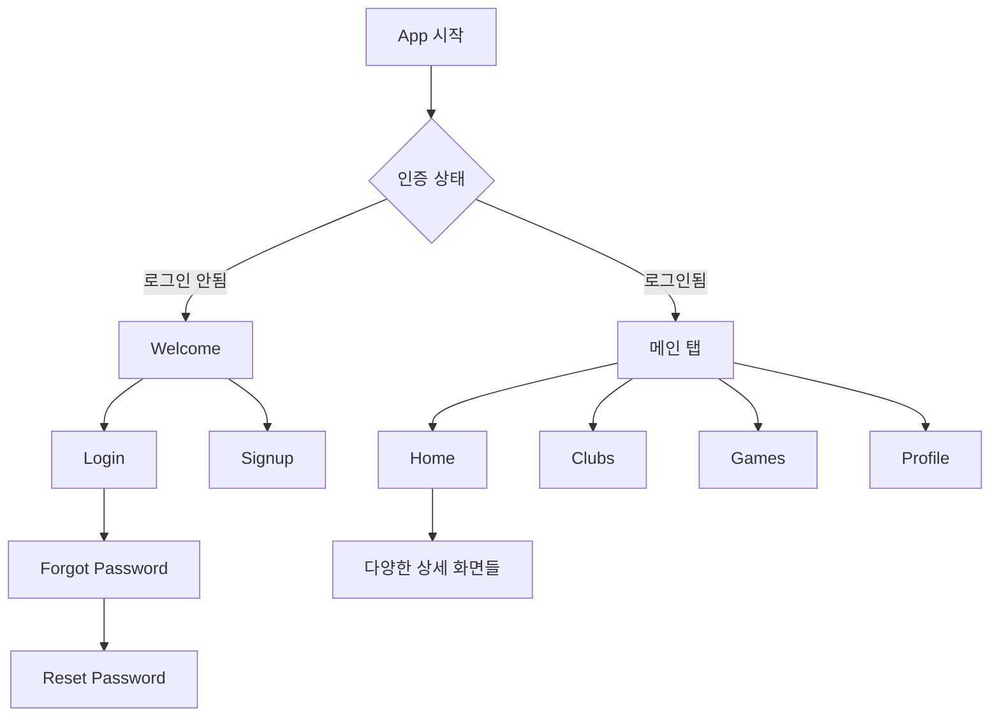

# 개발 로그 (Development Log)

## 📅 2024년 1월 27일

### 🎯 목표
React Native 프론트엔드 개발 시작 및 핵심 기능 구현

### ✅ 완성된 작업

#### 1. 프로젝트 초기 설정
**시간**: 09:00 - 10:00
**작업 내용**:
- React Native + Expo 프로젝트 생성
- 필수 패키지 설치 및 설정
- 프로젝트 디렉토리 구조 설계

**주요 패키지**:
```json
{
  "expo": "~51.0.28",
  "@react-navigation/native": "^6.1.18",
  "@react-navigation/stack": "^6.4.1",
  "@react-navigation/bottom-tabs": "^6.6.1",
  "react-native-paper": "^5.12.3",
  "socket.io-client": "^4.7.5",
  "axios": "^1.6.2",
  "react-hook-form": "^7.48.2",
  "@react-native-async-storage/async-storage": "^1.21.0"
}
```

#### 2. 테마 시스템 구현
**시간**: 10:00 - 10:30
**파일**: `src/utils/theme.js`
**작업 내용**:
- 배드민턴 테마 색상 시스템 정의
- Material Design 기반 디자인 토큰
- 실력 레벨별 색상 구분 시스템

**핵심 특징**:
- 코트 블루 (#1976D2) 메인 컬러
- 레벨별 색상 시스템 (초급: 초록, 중급: 주황, 고급: 보라, 전문가: 빨강)
- 반응형 간격 시스템

#### 3. API 서비스 레이어
**시간**: 10:30 - 12:00
**파일**: `src/services/api.js`
**작업 내용**:
- Axios 기반 HTTP 클라이언트 구현
- JWT 토큰 자동 관리 (인터셉터)
- 토큰 갱신 로직 구현
- 모든 API 엔드포인트 정의

**주요 API 그룹**:
- `authAPI`: 인증 관련
- `userAPI`: 사용자 관리
- `clubAPI`: 클럽 관리
- `gameAPI`: 게임 관리
- `statisticsAPI`: 통계
- `fcmAPI`: 푸시 알림
- `notificationAPI`: 알림 관리

#### 4. 상태 관리 시스템
**시간**: 12:00 - 14:00

**AuthContext** (`src/context/AuthContext.js`):
- JWT 기반 인증 상태 관리
- 자동 로그인/로그아웃
- 사용자 정보 관리
- 토큰 만료 처리

**SocketContext** (`src/context/SocketContext.js`):
- Socket.IO 연결 관리
- 실시간 알림 수신
- 자동 재연결 로직
- 방(Room) 관리

#### 5. 네비게이션 구조
**시간**: 14:00 - 15:00
**작업 내용**:

**AppNavigator** (`src/navigation/AppNavigator.js`):
- 인증 상태 기반 네비게이션
- 로딩 스크린 처리

**AuthNavigator** (`src/navigation/AuthNavigator.js`):
- 인증 플로우 관리
- Welcome → Login/Signup → Password Reset

**MainNavigator** (`src/navigation/MainNavigator.js`):
- 하단 탭 네비게이션 (Home, Clubs, Games, Profile)
- 각 탭별 스택 네비게이터

#### 6. 인증 화면 구현
**시간**: 15:00 - 18:00

**WelcomeScreen** (`src/screens/auth/WelcomeScreen.js`):
- 브랜딩 중심 디자인
- 배경 이미지와 그라디언트
- 로그인/회원가입 버튼

**LoginScreen** (`src/screens/auth/LoginScreen.js`):
- React Hook Form 기반 폼 검증
- 이메일/비밀번호 입력
- 로그인 유지 옵션
- 소셜 로그인 준비 (UI만)

**SignupScreen** (`src/screens/auth/SignupScreen.js`):
- 포괄적인 회원가입 폼
- 실력 레벨 선택 (SegmentedButtons)
- 실시간 비밀번호 검증
- 약관 동의 체크박스

**ForgotPasswordScreen** (`src/screens/auth/ForgotPasswordScreen.js`):
- 이메일 기반 비밀번호 재설정
- 이메일 전송 상태 관리
- 재전송 기능

**ResetPasswordScreen** (`src/screens/auth/ResetPasswordScreen.js`):
- 새 비밀번호 설정
- 비밀번호 강도 측정 바
- 실시간 유효성 검사

#### 7. 메인 화면 구현
**시간**: 18:00 - 21:00

**HomeScreen** (`src/screens/main/HomeScreen.js`):
- 개인화된 대시보드
- 활동 통계 카드
- 다가오는 게임 섹션
- 내 클럽 목록
- 최근 활동 기록
- 빠른 액션 버튼들
- Pull-to-refresh 지원

**ClubsScreen** (`src/screens/main/ClubsScreen.js`):
- 클럽 목록 및 검색
- 실력 레벨별 필터링
- 클럽 가입 기능
- FAB로 클럽 생성 버튼

**GamesScreen** (`src/screens/main/GamesScreen.js`):
- 게임 목록 및 필터링 (전체/예정/완료/내 게임)
- 게임 상태별 칩 표시
- 참가자 수 실시간 표시
- 게임 참가 기능

**ProfileScreen** (`src/screens/main/ProfileScreen.js`):
- 사용자 프로필 정보
- 활동 통계 표시
- 랭킹 포인트 진행바
- 설정 메뉴 리스트
- 로그아웃 기능

#### 8. 공통 컴포넌트
**LoadingScreen** (`src/components/LoadingScreen.js`):
- 일관된 로딩 UI
- 커스텀 메시지 지원

### 🔧 기술적 구현 사항

#### 토큰 관리 시스템
```javascript
// 자동 토큰 갱신 인터셉터
api.interceptors.response.use(
  (response) => response,
  async (error) => {
    if (error.response?.status === 401 && !originalRequest._retry) {
      // 리프레시 토큰으로 새 액세스 토큰 획득
      const refreshToken = await AsyncStorage.getItem('refreshToken');
      const response = await axios.post('/auth/refresh', { refreshToken });
      // 원래 요청 재시도
      return api(originalRequest);
    }
    return Promise.reject(error);
  }
);
```

#### 실시간 알림 시스템
```javascript
// Socket.IO 연결 및 이벤트 처리
const connectSocket = () => {
  socketRef.current = io(SOCKET_URL, {
    auth: { token: token },
    transports: ['websocket'],
  });

  socketRef.current.on('notification:personal', (notification) => {
    setNotifications(prev => [notification, ...prev.slice(0, 49)]);
  });
};
```

#### 폼 검증 시스템
```javascript
// React Hook Form을 이용한 복합 검증
const {
  control,
  handleSubmit,
  watch,
  formState: { errors },
} = useForm({
  defaultValues: { /* ... */ },
});

// 비밀번호 일치 검증
rules={{
  validate: (value) => value === password || '비밀번호가 일치하지 않습니다',
}}
```

### 🎨 UI/UX 특징

#### 배드민턴 테마 디자인
- 스포츠 친화적 색상 조합
- 실력 레벨별 시각적 구분
- 직관적인 아이콘 사용

#### 사용자 경험 최적화
- 로딩 상태 표시
- 에러 처리 및 사용자 피드백
- 오프라인 상태 고려
- 접근성 지원

#### 반응형 디자인
- 다양한 화면 크기 지원
- 안전 영역 고려
- 키보드 대응

### 📱 화면 플로우



### 🔍 코드 품질

#### 일관된 코드 스타일
- ESLint + Prettier 설정
- 2스페이스 들여쓰기
- 단일 따옴표 사용

#### 컴포넌트 구조
- 함수형 컴포넌트 + Hooks
- Props 타입 검증
- 재사용 가능한 컴포넌트 설계

#### 에러 처리
- Try-catch 블록 일관된 사용
- 사용자 친화적 에러 메시지
- 로그 시스템 구현

### 🚨 해결된 이슈들

#### 1. 디렉토리 접근 권한 문제
**문제**: D:\project\ 경로 접근 거부
**해결**: C:\Users\taejo\ 경로로 변경

#### 2. Expo 프로젝트 생성 실패
**문제**: npx create-expo-app 명령어 실행 오류
**해결**: 수동으로 package.json 및 설정 파일 생성

#### 3. API 엔드포인트 누락
**문제**: HomeScreen에서 사용하는 API 누락
**해결**: api.js에 getMyClubs, getUpcomingGames, getRecentGames 추가

### 📊 성능 고려사항

#### 최적화 구현
- FlatList를 이용한 효율적인 리스트 렌더링
- 이미지 지연 로딩
- API 응답 캐싱

#### 메모리 관리
- useEffect cleanup 함수
- Socket 연결 정리
- 타이머 정리

### 🧪 테스트 준비
- 컴포넌트 단위 테스트 구조 준비
- API 모킹 시스템 설계
- E2E 테스트 시나리오 정의

### 📈 다음 단계 계획

#### 우선순위 높음
1. **상세 화면 구현**
   - ClubDetailScreen (클럽 정보, 멤버 목록, 가입 관리)
   - GameDetailScreen (게임 상세, 참가자 목록, 결과 입력)
   - GameCreateScreen (게임 생성 폼)

2. **핵심 기능 완성**
   - 이미지 업로드 (react-native-image-picker)
   - 지도 연동 (react-native-maps)
   - 푸시 알림 설정

#### 우선순위 중간
1. **사용자 경험 향상**
   - 프로필 편집 화면
   - 설정 화면
   - 알림 관리 화면

2. **고급 기능**
   - 채팅 시스템
   - 오프라인 지원
   - 다크 모드

#### 우선순위 낮음
1. **성능 최적화**
   - 번들 분석 및 최적화
   - 이미지 캐싱 시스템
   - 코드 스플리팅

2. **테스팅 및 배포**
   - 유닛 테스트 구현
   - 통합 테스트
   - 앱 스토어 배포 준비

### 💡 학습한 점들

#### React Native 특화 지식
- Expo의 장단점 및 활용법
- React Native Paper 컴포넌트 활용
- 네비게이션 상태 관리

#### 실시간 통신
- Socket.IO 클라이언트 최적화
- 연결 상태 관리
- 에러 처리 전략

#### 모바일 UI/UX
- 터치 친화적 인터페이스
- 키보드 대응
- 안전 영역 처리

### 🎯 내일 작업 목표
1. ClubDetailScreen 완성
2. GameDetailScreen 완성
3. GameCreateScreen 구현
4. 이미지 업로드 기능 추가
5. 지도 연동 기능 추가

**예상 소요 시간**: 6-8시간
**우선순위**: 상세 화면 > 이미지 업로드 > 지도 연동